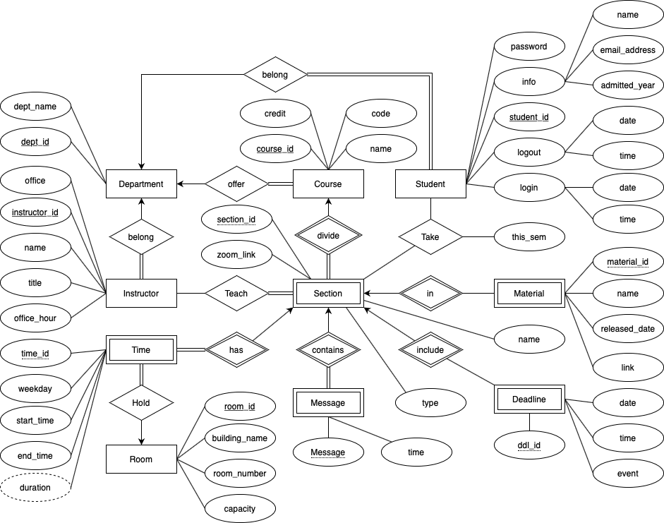

# COMP3278-FRLS
Course project for COMP3278 DBMS of Group2. Targeting on automatic login system by face recogniton. 

To use this project, first clone the repository to your own machine by

`git clone https://github.com/AArchLichKing/COMP3278-FRLS.git`

If you need to use the register function(which you need to train the model using train.xml. You can get these
files in the project.rar. The files are too big to be uploaded in Github.)

For other installing and running details, see our extra guidance video. 

Note that you need to install all libraries mentioned in this project to run the program. 

(Listed below)

tkinter

PIL

datetime, time

random

cv2, os 

mysql.connector

*ctypes (This one is only for resolution in Windows. If you are using Mac, please delete lines related to this)

To adjust the size of display, change the resizee and resizei in Homepage.py and self.i in Main.py.
(larger value, larger window.)
Note that the display might be sightly different on different computer. We highly recommend you to use windows to run this program. The computer using for guidance video is Thinkpad Carbon X1 with 4K Display. If your computer has lower resolution, 
you might need to lower the resize value.

If you are new version of main function, run 

`python main.py` and click Register New Student. 

Note that the home page can display information only when you are a student with legal student_id (username) i.e. your information is stored in the database. 

